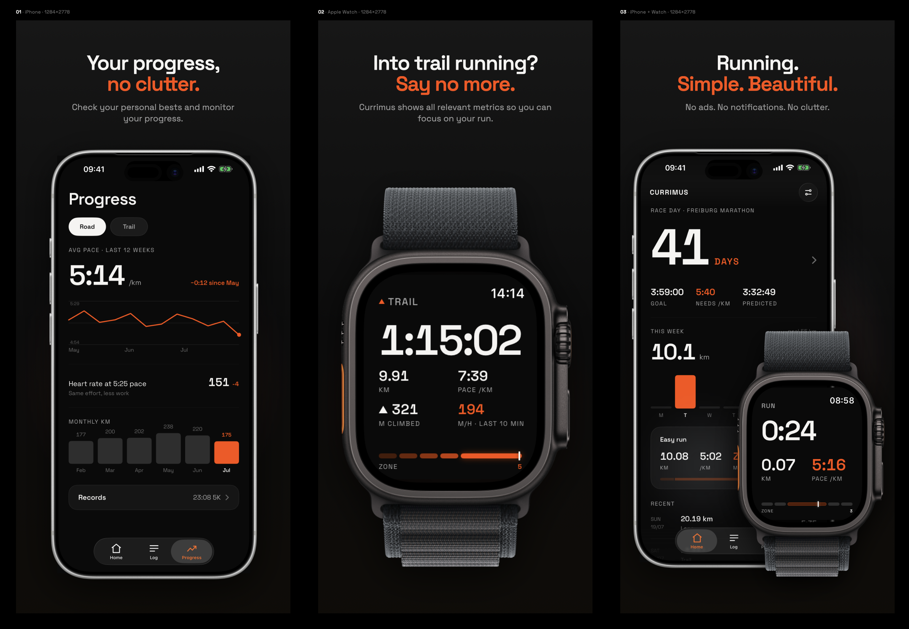

# CURRIMUS



## Simple. Beautiful. Yours.

Currimus is a minimalist running app for iPhone and Apple Watch. No ads, no
account, no feed — just the numbers that matter.

- **Your progress, no clutter.** Personal bests and pace trends at a glance.
- **Into trail running? Say no more.** Climb, descent and elevation live on
  the wrist, not buried in a menu.
- **Stay on pace, every step.** The Pacer tells you in real time whether
  you're running too fast or too slow.
- **Every run, in full detail.** Syncs with Apple Health both ways — nothing
  recorded twice, nothing lost.
- **Celebrate your records.** Every personal best in one place, including
  runs logged by other apps.

**Search "Currimus" on the App Store.**

---

## For developers

Two Xcode targets share one `Shared/` module: a watchOS app that owns
recording, and an iOS app that only reads. The watch is the sole source of
truth for a run — HealthKit supplies heart rate, distance and energy,
CoreLocation supplies the GPS route and altitude — and syncs a finished run
to the iPhone over WatchConnectivity; the iPhone never records, it only
aggregates, displays and edits. Both sides persist independently, so a phone
that was unreachable when a run finished still gets it on the next sync.

SwiftUI throughout; Swift 6 language mode with complete strict concurrency
(`RunStore` and `RunSession` are `@MainActor`); no backend — Apple Health is
the only external data store.

### Build

Requires Xcode 26 or later (for the iOS 26 / watchOS 11 SDKs) and
[XcodeGen](https://github.com/yonaskolb/XcodeGen) (`brew install xcodegen`).
`Currimus.xcodeproj` is generated, not source of truth — `project.yml` is:

```bash
xcodegen generate      # after cloning, and after any project.yml edit
open Currimus.xcodeproj
```

Or build the two app targets from the CLI, the same way the pre-push hook
and the UI snapshot script do:

```bash
xcodebuild -project Currimus.xcodeproj -scheme Currimus \
  -destination 'platform=iOS Simulator,name=iPhone 17 Pro' build
xcodebuild -project Currimus.xcodeproj -scheme CurrimusWatch \
  -destination 'platform=watchOS Simulator,name=Apple Watch Ultra 3 (49mm)' build
```

Signing is automatic; the team lives in `project.yml`
(`DEVELOPMENT_TEAM` under `settings.base`), because anything set by hand in
Xcode's Signing & Capabilities pane is overwritten on the next
`xcodegen generate`. The watch target's HealthKit entitlement, usage
descriptions and `workout-processing`/`location` background modes are
declared there too. The simulator builds without a HealthKit-enabled team;
a device build does not — if you're not on that team, swap
`DEVELOPMENT_TEAM` for your own (locally; don't commit it) before building
to a device.

### Test

```bash
git config core.hooksPath .githooks   # once per clone — enables the pre-push gate
```

- **Unit + simulation tests** — 97 cases across `PromptGateTests`,
  `RecordingPolicyTests`, `RunAnalyticsTests`, `RunExportTests`,
  `RunMetricsTests`, `RunSimulationTests` and `RunStoreTests`, each on a
  throwaway `UserDefaults` suite. Fast, headless, deterministic — this is
  what `.githooks/pre-push` runs on every push, and what to run first after
  any change:

  ```bash
  xcodebuild test -project Currimus.xcodeproj -scheme CurrimusTests \
    -destination 'platform=iOS Simulator,name=iPhone 17 Pro'
  ```

  `RunSimulationTests` drives a whole marathon or a six-hour ultra through
  the real `RunMetrics` pipeline in milliseconds instead of a real device
  session; the same scenarios also play live on the watch
  (`-simulate marathon`, `-at 25`, `-finish 1`), so a bug found headless is
  reproducible on screen — see [RUN-SIMULATION.md](docs/RUN-SIMULATION.md).

- **UI snapshot regression** — every screen against a committed reference
  image, captured as a real simulator screenshot rather than an in-process
  view snapshot, because the design leans on Liquid Glass, native pickers
  and MapKit that a view snapshot would not render faithfully. Manual, not
  gated — run it by hand after any UI change:

  ```bash
  scripts/ui-snapshot.sh verify all      # or ios | watch
  scripts/ui-snapshot.sh record all      # re-record references after an intentional change
  ```

  See [UI-SNAPSHOTS.md](docs/UI-SNAPSHOTS.md) for the diff tiers and what
  each one tolerates.

Bypass a single push with `git push --no-verify`; override the simulator
with `IOS_SIM="iPhone 16 Pro" git push`.

### Release

- [docs/RELEASE-CHECKLIST.md](docs/RELEASE-CHECKLIST.md) — everything that
  couldn't be automated: an Apple account, a browser, a credit card, a real
  wrist.
- [docs/STORE-LISTING.md](docs/STORE-LISTING.md) — paste-ready App Store
  Connect copy.
- [docs/README.md](docs/README.md) — publishing the privacy/support pages
  App Review requires, and what to double-check before you do.

## Recording pipeline

- `HKWorkoutSession` + `HKLiveWorkoutBuilder` — live heart rate, distance,
  energy; the finished run is saved to Apple Health as a running workout.
- `CLLocationManager` — GPS route (saved via `HKWorkoutRouteBuilder`) and
  altitude (climb / descent / elevation profile for trail mode). Background
  updates are on and the `location` background mode is declared: the wrist
  drops within seconds of the start, and without both the route simply stops
  there.
- HR zones from max HR, rolling last-kilometer pace, per-km splits with the
  5-second kilometer alert, 10-minute climb-rate window.
- The both-buttons hardware gesture pauses/resumes (session state is mirrored);
  tapping the run screen pauses too.
- Finished runs sync to the iPhone log via WatchConnectivity
  (`transferUserInfo`, queued while the phone is unreachable) and persist on
  both sides.

## Flows (all interactive)

- **Quick run**: Start → countdown → run glance (time / km / pace / zone bar)
  → km alerts → pause (End / Resume) → summary, crown scrolls to Done → Home.
- **Pacer**: Pacer → step 1 target pace (crown wheel, required) → Next →
  step 2 distance (crown wheel, `Off` = open-ended) → Start → live pacing
  (deviation gauge; with distance: `/ 10 KM` counter + finish forecast;
  without: plain KM + cumulative delta) → pacer summary (target vs. actual)
  → Done → Home.
- **Trail**: Trail → trail glance (climb + m/h) ⇄ swipe: elevation page
  (planned-route profile with "M TO TOP", or profile-so-far without a route)
  → trail summary (vert equal billing, profile) → Done → Home.

## Structure

| Folder | Target | Contents |
|---|---|---|
| `Watch/` | `CurrimusWatch` (watchOS app, embedded) | All screens above; `RunSession` drives the recording lifecycle (HealthKit + CoreLocation, simulation only in DEBUG screenshot routes) |
| `iOS/` | `Currimus` (iOS app) | Home (week, day bars, last run), Log → Run detail → Edit, Progress → Records, Settings → Pacer target, first-launch state |
| `WatchWidgets/` | `CurrimusWatchWidgets` (WidgetKit) | Circular complication, Smart Stack card, inline |
| `Shared/` | all targets | Theme, models, formatters, zones, `RunStore` (persisted), `RunSync` (WatchConnectivity), `RunMetrics` (the run's arithmetic), `RunSampleStore` (GPS tracks + altitude series) |
| `Tests/` | `CurrimusTests` | `PromptGate`, `RecordingPolicy`, `RunAnalytics`, `RunExport`, `RunMetrics`, `RunSimulation`, `RunStore` — 97 cases, each on a throwaway defaults suite; `UISnapshots/` holds the screenshot-regression references (see [Test](#test)) |
| `Resources/` | both apps | `Localizable.xcstrings` — the string catalogue |
| `Assets/make_icon.swift` | — | Renders the app icon; `swift Assets/make_icon.swift out.png` |
| `DesignRefs/` | — | Imported Claude Design HTML used as the pixel reference |
| `Fonts/` | both apps | Space Grotesk (OFL-licensed), the app's typeface |
| `Marketing/` | — | Raw screenshots behind the App Store listing and `docs/marketing-hero.png` |

### How a run is stored

The log lives in App-Group `UserDefaults` so the widget can read it, and
`UserDefaults` faults its whole backing plist into memory in every process
that opens the suite. So the log holds **metadata only**; the GPS track and
altitude series of each run go to one file per run under the app group
(`RunSampleStore`). `RunStore.hydrated(_:)` puts them back for the two callers
that need them — the run detail screen and the GPX export. Logs written before
this migrate on first load.

`RunMetrics` is the arithmetic of a run in flight — rolling pace, splits,
climb, time in zones, and the sampling of altitude and route. It is pure, so
it is unit-tested; `RunSession` is the HealthKit and CoreLocation lifecycle
around it. When a sample buffer fills it halves its resolution rather than
dropping from the front, so a four-hour run keeps its start.

### When recording cannot work

Distance and heart rate both come out of the workout builder, so **a run needs
Apple Health**. If the workout write is denied, the run does not start: a
screen names the problem and spells out the Settings path (watchOS has no URL
that opens Settings). Location is different — without it a run loses its route,
climb and elevation but keeps distance, pace and zones, so it only degrades and
never blocks. `RecordingIssue.blocksRecording` is where that line is drawn.

One denial cannot be caught at the door. Health hides *read* authorization by
design, so someone can allow "save workouts" — all the gate can observe — and
refuse Distance separately. That shows up only once the run is moving and the
number stays at zero, which `checkDistanceIsArriving` reports as a live banner
after two minutes. A run that ends without distance is shown on the summary and
then dropped rather than filed as a 0.00 km entry.

Everything else that used to be swallowed goes to `os.Logger` under the
`com.currimus.app` subsystem.

## Demo / screenshot routing (DEBUG builds only)

`-demo 1` seeds sample data; `-screen …` jumps into a simulated state:

- watchOS: `run | kmalert | paused | summary | pacer-set | pacer-distance |
  pacer-run | pacer-run-nodist | pacer-summary | trail | elevation |
  elevation-noroute | trail-summary | blocked-health | blocked-workout |
  blocked-unavailable | issue-nodistance | issue-location | issue-summary |
  summary-empty`
- iOS: `-tab log|progress`, `-push detailRoad|detailTrail|editRun|race|raceSetup|
  records|settings|pacerDefaults|hrZones|gpsAccuracy`, `-empty 1`,
  `-home norace|raceday`, `-zones derived`

Release builds contain none of this — the engine always records for real.

## What the watch deliberately does not do

The watch has no run history: Home is Start, Trail and Pacer, and a finished
run ends at Done. That is the split the whole app is built on — **the watch
records, the iPhone reads** — and it is a decision rather than an omission.
A log on a 40 mm screen is a worse version of one that is already in a pocket,
and every screen added to the watch is a screen to keep aligned with the
phone. The week total does reach the wrist, as a complication, which is the
one number worth a glance mid-day.

Records and race predictions need per-kilometre splits, which only runs
Currimus recorded carry. A run imported from Apple Health is one distance and
one duration, so it holds a benchmark by being scaled onto it rather than by
a rolling window — see `RunAnalytics.bestEffortHolder`. The estimate never
displaces a real PR; it only fills a row that would otherwise be empty.

## Next

- GPX route import on the iPhone → planned-route elevation on the watch.
- Routes for imported runs: `HKWorkoutRouteQuery` can read the track another
  app saved, which would put those runs on the map too.
- Miles. Deliberately not shipped in 1.0 rather than half-shipped: it touches
  every number in both apps, the pacer wheels, the kilometre alert, the
  splits, the widget and the export.
- Translations: the catalogue is wired up and extracts, but English is the
  only language in it. Xcode repopulates it on build; from the command line,
  `xcrun xcstringstool sync Resources/Localizable.xcstrings --stringsdata …`.
- Nothing for a run without Health access: recording it from GPS alone was
  considered and rejected — it would mean a second distance pipeline with its
  own noise filtering and calibration, for a mode the app does not offer.
